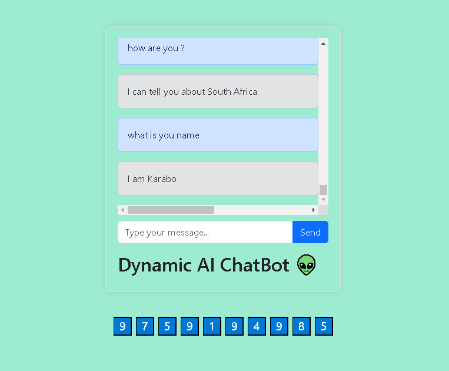
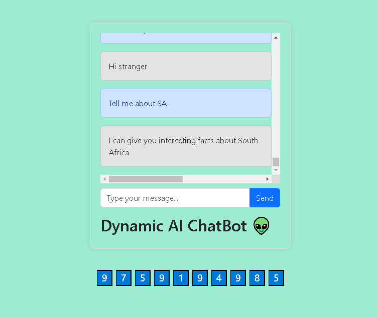

# fully customizable Dynamic chatbot from scratch.

 Aim :- Develope an AI-powered chatbot with exceptional flexibility and robustness, enabling easy customization of its behavior to meet
diverse requirements with minimal effort, utilize the power of natural language processing.

## Description
<ul>
<li>Developed NLP models to enable the chatbot to understand and respond effectively to user queries.</li>
<li>Leveraged state-of-the-art AI methodologies to incorporate sentiment analysis and context awareness, enhancing the
chatbot's conversational capabilities, as well as utilize the cosine similarity to respond effectively to user.</li>
<li>•Designed a user-friendly web interface that enabled non-technical users to interact with the chatbot and fine-tune its
behavior by adjusting dataset parameters, no need to play with coding if chatbot behavior alteration required. project
pipeline made the changes in chatbot behavior by determine the dataset parametes.</li>
</ul>
 

## GUI images with Demo
<h2>First Image </h2>

 

<h2>Second Image </h2>

## Fully Customizable Dynamic Chatbot Development

Welcome to my repository where I am excited to share the development journey of a cutting-edge, fully customizable dynamic chatbot, built entirely from the ground up. This project is designed to empower users like you with unparalleled control over your chatbot's behavior.

Once this chatbot is fully developed, you'll have the remarkable ability to effortlessly tailor its interactions to suit your specific needs. Instead of grappling with complex coding tasks, all you'll need to do is make strategic edits to the dataset. Imagine, within moments, your chatbot will seamlessly adapt to your requirements.

The culmination of this endeavor will be an intuitive API-like interface that provides seamless access to the chatbot's capabilities. Not only can you take advantage of the chatbot I've developed, but you can also craft your very own customized chatbot by simply manipulating the dataset. This process has been meticulously designed to be user-friendly, ensuring that anyone can engage with it effortlessly.

The cornerstone of this chatbot's architecture lies in its innate ability to interpret changes in the dataset. As you refine the dataset, the chatbot's behavior will seamlessly align with your specifications. No intricate coding, just pure simplicity.

Join me on this exciting journey as I endeavor to create a truly dynamic chatbot experience that transcends the barriers of traditional development. Together, we're transforming coding challenges into dataset empowerment, ushering in a new era of dynamic and adaptable chatbots.

Feel free to explore the repository, engage with the code, and witness firsthand the evolution of this dynamic chatbot. Your feedback and contributions are highly valued as we collectively shape the future of conversational AI.

Let's redefine chatbot development, one dataset edit at a time.

## To altered the behavior of the ChatBot as per your requirements

<b>Data file path :- Data\intent.json</b>

either you can directly upload your file instead of my 
"intent.json" file and you can anotate your dataset with in this file. after the data anotation, you will have to follow some commands, to use your chatbot, all are commands and steps are mentioned below 👇

## Commands To Execute The Base ChatBot
<ul>
<li>clone this repos.</li>
<li>install all the dependencies</li>
<li>run the app.py</li>

</ul>

## Commands, if you have altered the dataset parameter
<ul>
<li>clone the repos..</li>
<li>install the dependencies.</li>
<li>run python train.py</li>
<li>run python app.py</li>
</ul>

## commands
-- pip install -r requirements.txt
-- python train.py
-- python app.py

## YOU DON`T NEED TO PLAY WITH CODING, DEVELOPE YOUR CHATBOT😍 WITH IN FEW MINUTES, AND FREE OF COST 😋.

##  🏴‍☠️  THANK YOU  🏴‍☠️